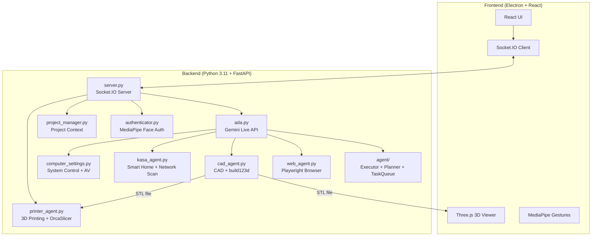

# NOVA - AI Personal Assistant


> **NOVA** = **N**etworked **O**perational **V**irtual **A**ssistant

NOVA is an intelligent AI assistant designed for multimodal interaction. It combines Google's Gemini 2.5 Native Audio with computer vision, gesture control, smart home integration, and autonomous task execution in an Electron desktop application.

---

## 🌟 Capabilities at a Glance

| Feature | Description | Technology |
|---------|-------------|------------|
| **🗣️ Low-Latency Voice** | Real-time conversation with interrupt handling | Gemini 2.5 Native Audio |
| **� Autonomous Agent** | Task planning & execution with ThreadPoolExecutor | Custom Agent Framework |
| **� Parametric CAD** | Editable 3D model generation from voice prompts | `build123d` → STL |
| **🖨️ 3D Printing** | Slicing and wireless print job submission | OrcaSlicer + Moonraker/OctoPrint |
| **🖐️ Minority Report UI** | Gesture-controlled window manipulation | MediaPipe Hand Tracking |
| **👁️ Face Authentication** | Secure local biometric login | MediaPipe Face Landmarker |
| **🌐 Web Agent** | Autonomous browser automation | Playwright + Chromium |
| **🏠 Smart Home** | Voice control for Kasa devices & network scanning | `python-kasa` + Multi-protocol |
| **📺 TV Control** | Control smart TVs and streaming devices | Chromecast/Roku/Samsung APIs |
| **📁 Project Memory** | Persistent context across sessions | File-based JSON storage |
| **🔒 System Security** | Antivirus scans & software checks | Windows Security APIs |

### 🖐️ Gesture Control Details

NOVA's "Minority Report" interface uses your webcam to detect hand gestures:

| Gesture | Action |
|---------|--------|
| 🤏 **Pinch** | Confirm action / click |
| ✋ **Open Palm** | Release the window |
| ✊ **Close Fist** | "Select" and grab a UI window to drag it |

> **Tip**: Enable the video feed window to see the hand tracking overlay.

---

## 🏗️ Architecture Overview



---

## ⚡ TL;DR Quick Start (Experienced Developers)

<details>
<summary>Click to expand quick setup commands</summary>

```bash
# 1. Clone and enter
git clone https://github.com/victorndlovu/nova.git && cd nova

# 2. Create Python environment (Python 3.11)
conda create -n nova python=3.11 -y && conda activate nova
brew install portaudio  # macOS only (for PyAudio)
pip install -r requirements.txt
playwright install chromium

# 3. Setup frontend
npm install

# 4. Create .env file
echo "GEMINI_API_KEY=your_key_here" > .env

# 5. Run!
conda activate nova && npm run dev
```

</details>

---

## 🛠️ Installation Requirements

### 🆕 Absolute Beginner Setup (Start Here)
If you have never coded before, follow these steps first!

**Step 1: Install Visual Studio Code (The Editor)**
- Download and install [VS Code](https://code.visualstudio.com/). This is where you will write code and run commands.

**Step 2: Install Anaconda (The Manager)**
- Download [Miniconda](https://docs.conda.io/en/latest/miniconda.html) (a lightweight version of Anaconda).
- This tool allows us to create isolated "playgrounds" (environments) for our code so different projects don't break each other.
- **Windows Users**: During install, check "Add Anaconda to my PATH environment variable" (even if it says not recommended, it makes things easier for beginners).

**Step 3: Install Git (The Downloader)**
- **Windows**: Download [Git for Windows](https://git-scm.com/download/win).
- **Mac**: Open the "Terminal" app (Cmd+Space, type Terminal) and type `git`. If not installed, it will ask to install developer tools—say yes.

**Step 4: Get the Code**
1. Open your terminal (or Command Prompt on Windows).
2. Type this command and hit Enter:
   ```bash
   git clone https://github.com/victorndlovu/nova.git
   ```
3. This creates a folder named `nova`.

**Step 5: Open in VS Code**
1. Open VS Code.
2. Go to **File > Open Folder**.
3. Select the `nova` folder you just downloaded.
4. Open the internal terminal: Press `Ctrl + ~` (tilde) or go to **Terminal > New Terminal**.

---

### ⚠️ Technical Prerequisites
Once you have the basics above, continue here.

### 1. System Dependencies

**MacOS:**
```bash
# Audio Input/Output support (PyAudio)
brew install portaudio
```

**Windows:**
- No additional system dependencies required!

### 2. Python Environment
Create a single Python 3.11 environment:

```bash
conda create -n nova python=3.11
conda activate nova

# Install all dependencies
pip install -r requirements.txt

# Install Playwright browsers
playwright install chromium
```

### 3. Frontend Setup
Requires **Node.js 18+** and **npm**. Download from [nodejs.org](https://nodejs.org/) if not installed.

```bash
# Verify Node is installed
node --version  # Should show v18.x or higher

# Install frontend dependencies
npm install
```

### 4. 🔐 Face Authentication Setup
To use the secure voice features, NOVA needs to know what you look like.

1. Take a clear photo of your face (or use an existing one).
2. Rename the file to `reference.jpg`.
3. Drag and drop this file into the `nova/backend` folder.
4. (Optional) You can toggle this feature on/off in `settings.json` by changing `"face_auth_enabled": true/false`.

---

## ⚙️ Configuration (`settings.json`)

The system creates a `settings.json` file on first run. You can modify this to change behavior:

| Key | Type | Description |
| :--- | :--- | :--- |
| `face_auth_enabled` | `bool` | If `true`, blocks all AI interaction until your face is recognized via the camera. |
| `tool_permissions` | `obj` | Controls manual approval for specific tools. |
| `tool_permissions.generate_cad` | `bool` | If `true`, requires you to click "Confirm" on the UI before generating CAD. |
| `tool_permissions.run_web_agent` | `bool` | If `true`, requires confirmation before opening the browser agent. |
| `tool_permissions.write_file` | `bool` | **Critical**: Requires confirmation before the AI writes code/files to disk. |

---

### 5. 🖨️ 3D Printer Setup
NOVA can slice STL files and send them directly to your 3D printer.

**Supported Hardware:**
- **Klipper/Moonraker** (Creality K1, Voron, etc.)
- **OctoPrint** instances
- **PrusaLink** (Experimental)

**Step 1: Install Slicer**
NOVA uses **OrcaSlicer** (recommended) or PrusaSlicer to generate G-code.
1. Download and install [OrcaSlicer](https://github.com/SoftFever/OrcaSlicer).
2. Run it once to ensure profiles are created.
3. NOVA automatically detects the installation path.

**Step 2: Connect Printer**
1. Ensure your printer and computer are on the **same Wi-Fi network**.
2. Open the **Printer Window** in NOVA (Cube icon).
3. NOVA automatically scans for printers using mDNS.
4. **Manual Connection**: If your printer isn't found, use the "Add Printer" button and enter the IP address (e.g., `192.168.1.50`).

---

### 6. 🧠 Agent System

NOVA features an autonomous agent system for complex task execution:

**Components:**
- **Executor** (`agent/executor.py`) - Main execution engine with tool routing
- **Planner** (`agent/planner.py`) - Task decomposition and planning
- **Task Queue** (`agent/task_queue.py`) - ThreadPoolExecutor for background tasks
- **Error Handler** (`agent/error_handler.py`) - Error recovery and retries

**Key Features:**
- **Tool Routing**: Automatically routes tools using TOOL_ALIASES mapping
- **Background Execution**: Tasks run in ThreadPoolExecutor threads
- **Async/Await Support**: `submit_async()` and `get_result_async()` for awaiting tasks
- **Natural Language**: "Check for viruses" → routes to `computer_settings` with AV actions

---

### 7. 🔑 Gemini API Key Setup
NOVA uses Google's Gemini API for voice and intelligence. You need a free API key.

1. Go to [Google AI Studio](https://aistudio.google.com/app/apikey).
2. Sign in with your Google account.
3. Click **"Create API Key"** and copy the generated key.
4. Create a file named `.env` in the `nova` folder (same level as `README.md`).
5. Add this line to the file:
   ```
   GEMINI_API_KEY=your_api_key_here
   ```
6. Replace `your_api_key_here` with the key you copied.

> **Note**: Keep this key private! Never commit your `.env` file to Git.

---

## 🚀 Running NOVA

You have two options to run the app. Ensure your `nova` environment is active!

### Option 1: The "Easy" Way (Single Terminal)
The app is smart enough to start the backend for you.
1. Open your terminal in the `nova` folder.
2. Activate your environment: `conda activate nova`
3. Run:
   ```bash
   npm run dev
   ```
4. The backend will start automatically in the background.

### Option 2: The "Developer" Way (Two Terminals)
Use this if you want to see the Python logs (recommended for debugging).

**Terminal 1 (Backend):**
```bash
conda activate nova
python backend/server.py
```

**Terminal 2 (Frontend):**
```bash
# Environment doesn't matter here, but keep it simple
npm run dev
```

---

## ✅ First Flight Checklist (Things to Test)

1. **Voice Check**: Say "Hello NOVA". She should respond.
2. **Vision Check**: Look at the camera. If Face Auth is on, the lock screen should unlock.
3. **CAD Check**: Open the CAD window and say "Create a cube". Watch the logs.
4. **Web Check**: Open the Browser window and say "Go to Google".
5. **Smart Home**: If you have Kasa devices, say "Turn on the lights".
6. **Network Scan**: Say "Check my TV" or "List network devices".
7. **Agent Task**: Say "Check for viruses" or "Investigate CPU usage".
8. **TV Control**: Say "Turn off the TV" (if smart TV detected).

---

## ▶️ Commands & Tools Reference

### 🗣️ Voice Commands

#### System & Agent
- "Check for viruses" / "Run antivirus scan"
- "Check what software is installed"
- "Investigate high CPU usage"
- "Optimize system performance"
- "List all network devices" / "Check my TV"
- "Turn off the TV" / "Control the TV"

#### Smart Home
- "Turn on the [Room] light"
- "Turn off the [Room] light"
- "Make the light [Color]"
- "Set brightness to [0-100]%"
- "List all smart devices"
- "Scan network for devices"

#### Projects
- "Switch project to [Name]"
- "Create a new project called [Name]"
- "List all projects"

#### Audio
- "Pause audio" / "Stop audio"
- "Resume audio"
- "Mute" / "Unmute"

### 🧊 3D CAD
- **Prompt**: "Create a 3D model of a hex bolt."
- **Iterate**: "Make the head thinner." (Requires previous context)
- **Files**: Saves to `projects/[ProjectName]/output.stl`.

### 📺 TV & Device Control
- **Scan**: "Check my TV" / "List network devices"
- **Turn Off**: "Turn off the TV" / "Switch off the TV"
- **Volume**: "Volume up/down" / "Mute the TV"
- **Playback**: "Play/Pause/Stop the TV"
- **Supported**: Chromecast, Roku, Samsung Smart TVs
- **Note**: Uses network protocols (UPnP, mDNS, ECP) for control

### 🔒 System Security
- **Check Antivirus**: "Check for viruses" / "What antivirus is installed?"
- **Run Scan**: "Run antivirus scan" / "Start virus scan"
- **Check Software**: "List installed software" / "What programs do I have?"
- **Monitor System**: "Check CPU usage" / "Investigate high memory usage"
- **Actions**: Windows Defender, Malwarebytes support

### 🌐 Web Agent
- **Prompt**: "Go to Amazon and find a USB-C cable under $10."
- **Note**: The agent will auto-scroll, click, and type. Do not interfere with the browser window while it runs.

### 🖨️ Printing & Slicing
- **Auto-Discovery**: NOVA automatically finds printers on your network.
- **Slicing**: Click "Slice & Print" on any generated 3D model.
- **Profiles**: NOVA intelligently selects the correct OrcaSlicer profile based on your printer's name (e.g., "Creality K1").

---

## ❓ Troubleshooting FAQ

### Camera not working / Permission denied (Mac)
**Symptoms**: Error about camera access, or video feed shows black.

**Solution**:
1. Go to **System Preferences > Privacy & Security > Camera**.
2. Ensure your terminal app (e.g., Terminal, iTerm, VS Code) has camera access enabled.
3. Restart the app after granting permission.

---

### `GEMINI_API_KEY` not found / Authentication Error
**Symptoms**: Backend crashes on startup with "API key not found".

**Solution**:
1. Make sure your `.env` file is in the root `nova` folder (not inside `backend/`).
2. Verify the format is exactly: `GEMINI_API_KEY=your_key` (no quotes, no spaces).
3. Restart the backend after editing the file.

---

### WebSocket connection errors (1011)
**Symptoms**: `websockets.exceptions.ConnectionClosedError: 1011 (internal error)`.

**Solution**:
This is a server-side issue from the Gemini API. Simply reconnect by clicking the connect button or saying "Hello NOVA" again. If it persists, check your internet connection or try again later.

---

## 📸 What It Looks Like

*Coming soon! Screenshots and demo videos will be added here.*

---

## 📂 Project Structure

```
nova/
├── backend/                    # 🤖 Python AI Backend
│   ├── agent/                  # 🧠 Autonomous Agent System
│   │   ├── executor.py         # AgentExecutor (google.genai)
│   │   ├── planner.py          # Task planning & replanning
│   │   ├── task_queue.py       # ThreadPoolExecutor task queue
│   │   └── error_handler.py    # Error handling
│   ├── ada.py                  # 🎯 AudioLoop - WebSocket, TTS, camera
│   ├── server.py               # 🌐 FastAPI + Socket.IO server
│   ├── tool_handler.py         # 🛠️ Tool execution handlers
│   ├── tools.py                # 📋 Tool definitions & schemas
│   ├── cad_agent.py            # 🧊 CAD generation orchestrator
│   ├── printer_agent.py        # 🖨️ 3D printer discovery & slicing
│   ├── web_agent.py            # 🌐 Playwright browser automation
│   ├── kasa_agent.py           # 🏠 Smart home + network scan (ARP/UPnP/mDNS)
│   ├── computer_settings.py    # ⚙️ System settings + AV/security actions
│   ├── computer_control.py     # 🖱️ Screen/mouse/keyboard control
│   ├── authenticator.py        # 🔐 MediaPipe face auth logic
│   ├── project_manager.py      # 📁 Project context management
│   ├── memory_manager.py       # 🧠 Memory system
│   ├── proactive_monitor.py    # 📊 System monitoring
│   ├── context_scope_engine.py # 🎯 Domain detection
│   ├── desktop.py              # 🖥️ Desktop automation
│   ├── dev_agent.py            # 💻 Development agent
│   └── reference.jpg           # 👤 Your face photo (add this!)
├── src/                        # ⚛️ React Frontend
│   ├── App.jsx                 # Main application component
│   ├── components/             # UI components
│   │   ├── ChatModule.jsx      # 💬 Chat interface
│   │   ├── Visualizer.jsx      # 📊 Audio visualizer
│   │   ├── TopAudioBar.jsx     # 🎵 Audio controls
│   │   ├── BrowserWindow.jsx   # 🌐 Browser window
│   │   ├── KasaWindow.jsx      # 🏠 Smart home window
│   │   ├── CadWindow.jsx       # 🧊 CAD viewer window
│   │   ├── PrinterWindow.jsx   # 🖨️ Printer window
│   │   ├── SettingsWindow.jsx  # ⚙️ Settings window
│   │   ├── ToolsModule.jsx     # 🛠️ Tools panel
│   │   ├── AuthLock.jsx        # 🔒 Authentication lock
│   │   ├── ConfirmationPopup.jsx # ✅ Confirmation dialogs
│   │   ├── MemoryPrompt.jsx    # 💭 Memory prompts
│   │   └── Visualizer.jsx      # 📊 Audio visualizer
│   ├── index.css               # Global styles
│   └── main.jsx                # React entry point
├── electron/                   # 💻 Electron main process
│   └── main.js                 # Window & IPC setup
├── memory/                     # 🧠 Persistent memory storage
├── projects/                   # 📂 User project data (auto-created)
├── tests/                      # 🧪 Test suite
├── .env                        # 🔑 API keys (create this!)
├── requirements.txt            # 📦 Python dependencies
├── package.json                # 📦 Node.js dependencies
└── README.md                   # 📖 You are here!
```

---

## ⚠️ Known Limitations

| Limitation | Details |
|------------|---------|
| **macOS & Windows** | Tested on macOS 14+ and Windows 10/11. Linux is untested. |
| **Camera Required** | Face auth and gesture control need a working webcam. |
| **Gemini API Quota** | Free tier has rate limits; heavy CAD iteration may hit limits. |
| **Network Dependency** | Requires internet for Gemini API (no offline mode). |
| **Single User** | Face auth recognizes one person (the `reference.jpg`). |
| **TV Control** | Requires network-connected smart TV (Chromecast/Roku/Samsung). IR control not supported. |
| **Agent Tasks** | Complex multi-step tasks may require manual intervention on failure. |

---

## 🤝 Contributing

Contributions are welcome! Here's how:

1. **Fork** the repository.
2. **Create a branch**: `git checkout -b feature/amazing-feature`
3. **Commit** your changes: `git commit -m 'Add amazing feature'`
4. **Push** to the branch: `git push origin feature/amazing-feature`
5. **Open a Pull Request** with a clear description.

### Development Tips

- Run the backend separately (`python backend/server.py`) to see Python logs.
- Use `npm run dev` without Electron during frontend development (faster reload).
- The `projects/` folder contains user data—don't commit it to Git.
- The `memory/` folder contains persistent memory—don't commit it to Git.
- For agent debugging, check logs in `agent/` module output.
- For TV control, ensure your TV supports network protocols (UPnP/mDNS/ECP).
- For antivirus features, Windows Defender and Malwarebytes are auto-detected.

---

## 🔒 Security Considerations

| Aspect | Implementation |
|--------|----------------|
| **API Keys** | Stored in `.env`, never committed to Git. |
| **Face Data** | Processed locally, never uploaded. |
| **Tool Confirmations** | Write/CAD/Web actions can require user approval. |
| **No Cloud Storage** | All project data stays on your machine. |

> [!WARNING]
> Never share your `.env` file or `reference.jpg`. These contain sensitive credentials and biometric data.

---

## 🙏 Acknowledgments

- **[Google Gemini](https://deepmind.google/technologies/gemini/)** — Native Audio API for real-time voice
- **[build123d](https://github.com/gumyr/build123d)** — Modern parametric CAD library
- **[MediaPipe](https://developers.google.com/mediapipe)** — Hand tracking, gesture recognition, and face authentication
- **[Playwright](https://playwright.dev/)** — Reliable browser automation

---

## 📄 License

This project is licensed under the **MIT License** — see the [LICENSE](LICENSE) file for details.

---

<p align="center">
  <strong>Created by Nazir Louis 🤖 Upgraded by Victor Ndlovu</strong><br>
  <em>Your Intelligent AI Assistant - NOVA</em>
</p>
